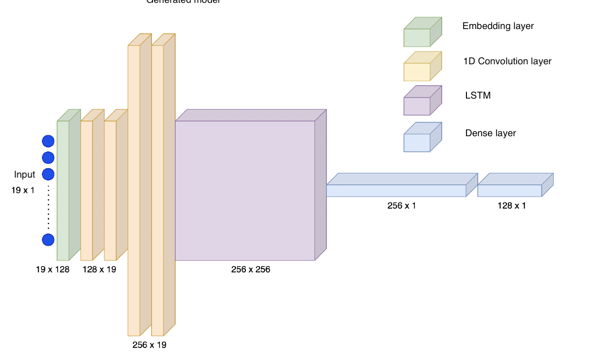
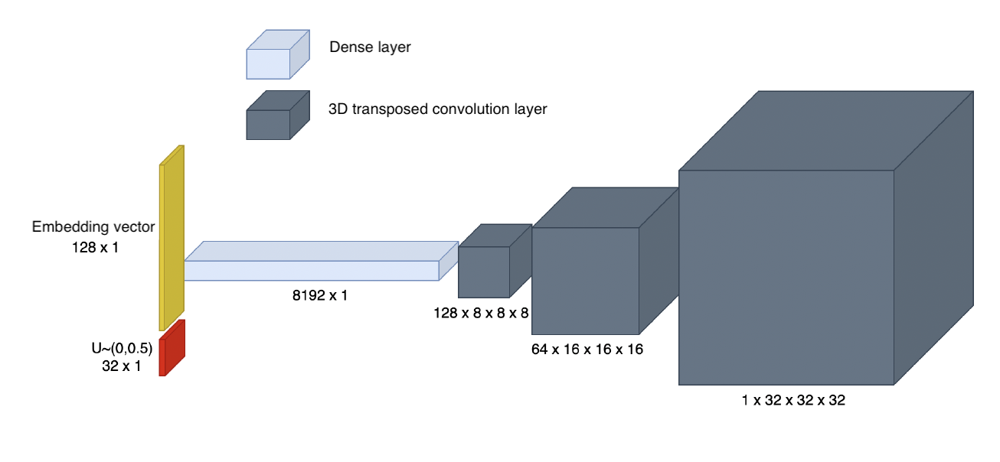
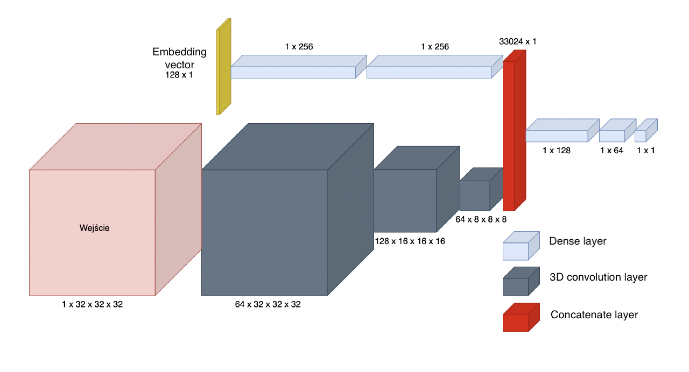
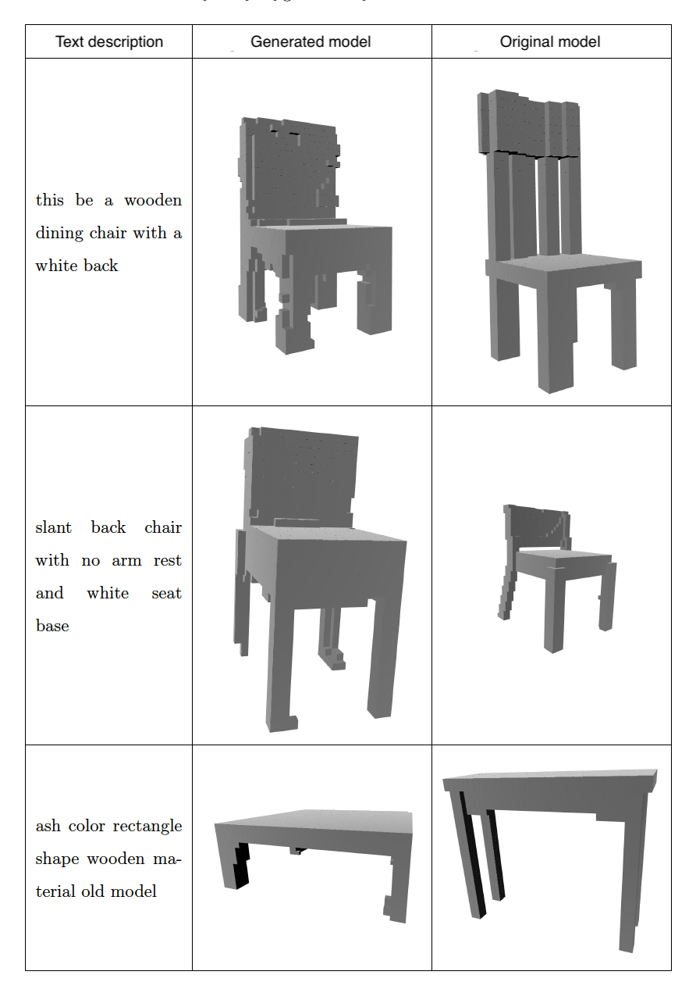
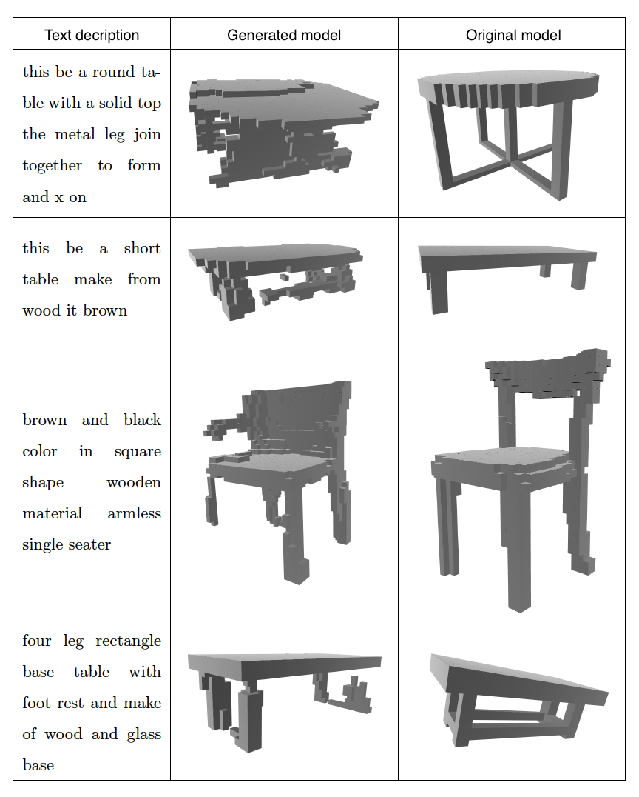

# 3D Model Generation from Text Prompts

Master thesis project

This work is inspired by the article _Text2Shape: Generating Shapes from Natural Language by Learning Joint Embeddings_ (http://text2shape.stanford.edu/), which has laid the groundwork for utilizing Conditional Wasserstein Generative Adversarial Networks (cWGANs) in conjunction with text encoders for 3D model generation.


## Overview

This project explores the generation of 3D models using deep learning techniques with text prompts. The primary objective is to develop a sophisticated system that can seamlessly translate textual descriptions into detailed 3D models, particularly focusing on voxel representation. It is important to note that the network in this project specializes in creating 3D models exclusively for chairs and tables. 

The entire project is implemented in Python, making use of the PyTorch framework for developing and training the neural network models. 

## Table of Contents

- [Introduction](#introduction) 
- [Dataset](#dataset)
- [Neural Networks Models](#dataset)
- [Results](#results)
- [Usage](#usage)


  


## Introduction

Creating 3D models is a complex and time-consuming task that requires specialized tools. The automation of this process can be facilitated by generative neural networks. An innovative approach has been proposed, involving the creation of a text encoder for efficient encoding of textual descriptions. As part of this process, a Conditional Wasserstein Generative Adversarial Network (cWGAN) has also been implemented for 3D model generation based on data encoded by the text encoder.
The text encoder has been developed to effectively transform textual descriptions into numerical vectors. The generated vectors are then used as conditions for cWGAN. As
a result, the output of the encoder serves as a conditional vector for the generative adversarial networks. This conditional vector introduces additional information, enabling the generation of 3D models following the details contained in the text. 

## Dataset

The neural network was trained on a dataset consisting of table and chair models accompanied by corresponding textual descriptions. The inclusion of diverse furniture models ensures the network's ability to understand and generate 3D structures based on textual input related to various furniture designs. 

Training data used in this project can be downloaded from the website: http://text2shape.stanford.edu/

## Neural Network Models

This project employs a dual neural network architecture, combining the capabilities of a Text Encoder and a Conditional Wasserstein Generative Adversarial Network (cWGAN).
The collaborative use of a Text Encoder and a cWGAN forms the foundation of our approach. The Text Encoder efficiently transforms textual descriptions into numerical vectors, serving as the conditional input for the subsequent cWGAN. This tandem architecture enables the generation of 3D models that faithfully represent the details specified in the input text.

### Text Encoder



### Generator



### CWGAN




## Results

In the table below, the obtained results for a given text description are presented, accompanied by a side-by-side comparison with the original model.

### Chairs



### Table




## Usage

To test the capabilities of the network, follow these steps:

1. Clone the repository to your local machine:

    ```bash
    git clone https://github.com/your-username/3D_GEN.git
    ```

2. Navigate to the project directory:

    ```bash
    cd 3D_GEN
    ```

3. Open the `test.ipynb` script in a Jupyter notebook environment.

4. Locate and execute the `singleRunGenerator` function within the notebook, providing your desired test description as an argument:

    ```python
    singleRunGenerator("Your desired test description")
    ```

This script is designed to assess the network's capabilities by generating a 3D model based on the provided textual description.


